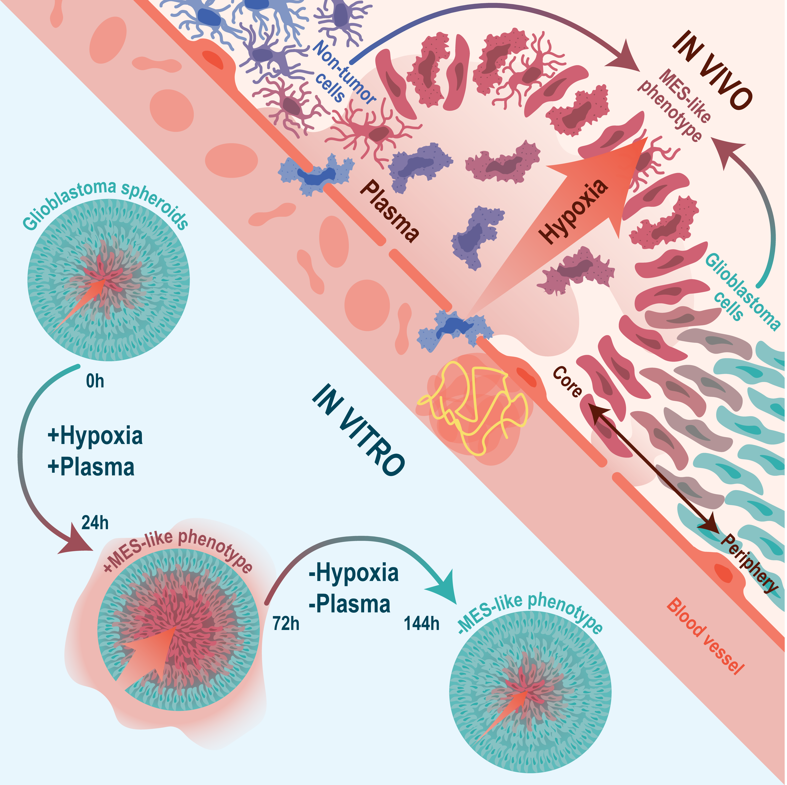

# Tissue-reactive zonation of mesenchymal-like phenotypes in human glioblastoma
*(In review)*

Follow the [Example Notebooks](https://github.com/linnarsson-lab/glioblastoma_wound_response/tree/main/Example_Notebooks) to visualize the data available below.  

We use the [FISHscale](https://github.com/linnarsson-lab/FISHscale) pipeline for unsupervised cell-free segmentation (m-states). We use the [FISHspace](https://github.com/linnarsson-lab/FISHspace) software for plotting m-cells and further analysis. FISHspace software is based on [stlearn](https://stlearn.readthedocs.io/en/latest/) with added plotting and processing functions.

For single-cell RNA sequencing data we used the [Shoji](https://github.com/linnarsson-lab/shoji) tensor database and the [cytograph-shoji](https://github.com/linnarsson-lab/cytograph-shoji) pipeline. 

### Download the data:
For visualization and exploration of [Molecules Spatial Coordinates](https://www.dropbox.com/scl/fi/c6ic9rzni0rvk8s1x2fqh/MoleculesLibrary.tar.gz?rlkey=0zil4yj44c4u5u1abo9jetl22&st=6h7e0hrc&dl=1) we recommend using [FISHscale](https://github.com/linnarsson-lab/FISHscale). FISHscale visualizer is based upon Open3D, allowing for blazing fast visualization of datasets of millions of RNA molecules.  

Complete spatial gene expression data can be downloaded at:  
[EEL gene expression matrix](https://storage.googleapis.com/linnarsson-lab-glioblastoma/EEL/DataSubmission/GBM_Linnarsson_EEL.h5ad)  
[Organoid expression matrix](https://www.dropbox.com/scl/fi/idg00yiotbdza3zlmbr3y/SL_OrganoidExperiment.h5ad?rlkey=iy9wcuj1ailpqwekp7yjetldj&st=6ev27gqc&dl=1)  
[Organoid scVI integrated expression matrix](https://www.dropbox.com/scl/fi/j7vrju7rlcxidzt8m8gli/GBMOrganoids_scVIsurgery20240408.h5ad?rlkey=n1f1izcu2od08xk1oamuzq22v&st=8rerlpvb&dl=1).

Spatial gene expression and accessory data files needed to reproduce the example notebook visualizations can be downloaded at:  
[EEL data for visualization](https://www.dropbox.com/scl/fi/0p7bzvq4m6fslueehgt2m/data_for_visualization.tar.gz?rlkey=swtjg8m1ptb1kej8zi3t6e3t0&st=df3z9isr&dl=1) (13 GB download, 57 GB uncompressed)

The raw single-cell RNA sequencing data for SL040 and SL057 are available at European Genome-phenome Archive under Accession number "EGAD50000001500".
The dataset can also be [browsed](https://cellxgene.cziscience.com/collections/113a558a-e96e-4643-81db-140e95c58578) at [CELLxGENE](https://cellxgene.cziscience.com/).
The other samples (single-cell and bulk) are available at European Genome-phenome Archive under Accession number TBA. All samples can be accessed as h5ad-files at google cloud storage:

[TruSeq Bulk GBO treated](https://www.dropbox.com/scl/fi/p2dgqe6e516jpbfb7n4f5/bulk_samples_GBO_treated.h5ad?rlkey=r5dipsjg895n8peo2tiaq3g3t&st=t96pu8i5&dl=1)  
[Smartseq Xpress Bulk GBO control](https://www.dropbox.com/scl/fi/cyogi70vlc4gn06g88c8m/bulk_samples_GBO_control_smartseq_2025.h5ad?rlkey=h9l7hke32imrsj64c3rz5h0fz&st=q5yl87h7&dl=1)  
[Smartseq Xpress Bulk astrocytes](https://www.dropbox.com/scl/fi/0koblyokuwo5p1bwlk4cr/bulk_samples_Astrocytes_smartseq_2025.h5ad?rlkey=tzj3m0c0hyczufixagdh1lm2m&st=0pspn2ed&dl=1)  
[Patient SL040 scRNA-seq](https://storage.googleapis.com/linnarsson-lab-glioblastoma/woundresponse/SL040.h5ad)  
[Patient SL057 scRNA-seq](https://storage.googleapis.com/linnarsson-lab-glioblastoma/woundresponse/SL057.h5ad)  
[Patient KS920+KS924+KS925 scRNA-seq](https://www.dropbox.com/scl/fi/36a3vwj941jjnb3o7k9ac/KS920_924_925.h5ad?rlkey=8evsm2y38bc17lvdfy264bcac&st=texc6zs6&dl=1)  
[Darmanis et al. Cell Rep. 2017 scRNA-seq](https://www.dropbox.com/scl/fi/b0j4pclgckctihewkl4nb/Darmanis.h5ad?rlkey=fe6eysm6ot8unwvfadnsxcv2u&st=ezqy1c54&dl=1)  

 

