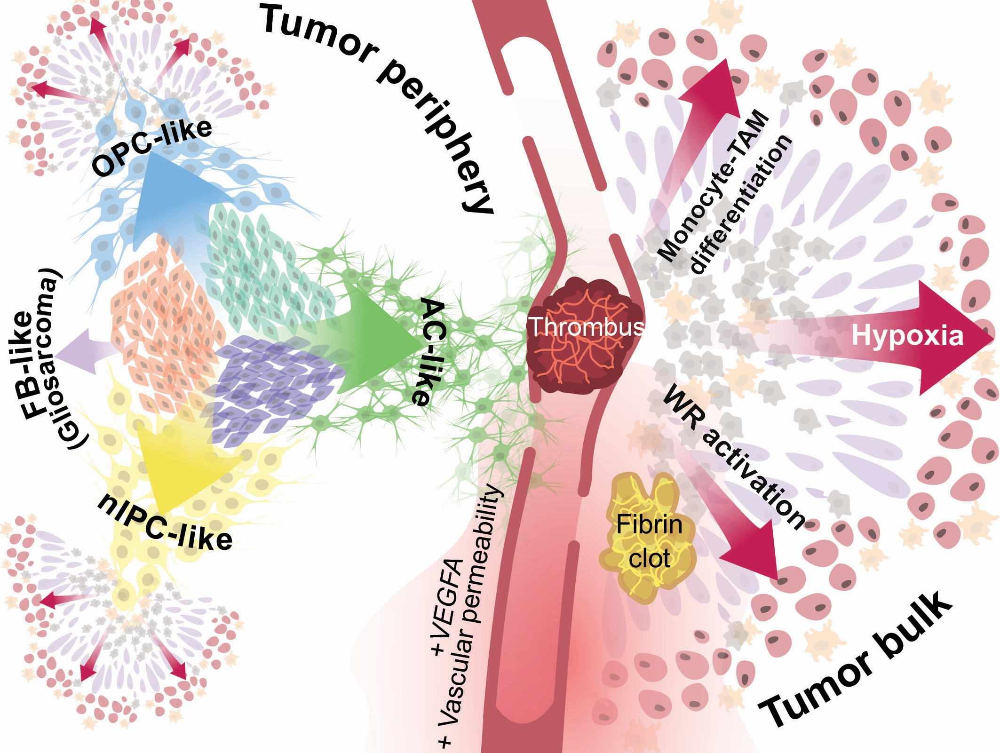

# Futile wound healing drives mesenchymal-like cell phenotypes in human glioblastoma
*(In review)*

Follow the [Example Notebooks](https://github.com/linnarsson-lab/glioblastoma_wound_response/tree/main/Example_Notebooks) to visualize the data available below.  
We use the [FISHscale](https://github.com/linnarsson-lab/FISHscale) pipeline for unsupervised cell-free segmentation (m-states). We use the [FISHspace](https://github.com/linnarsson-lab/FISHspace) software for plotting m-cells and further analysis. FISHspace software is based on [stlearn](https://stlearn.readthedocs.io/en/latest/) with added plotting and processing functions.

For single-cell RNA sequencing data we used the [Shoji](https://github.com/linnarsson-lab/shoji) tensor database and the [cytograph-shoji](https://github.com/linnarsson-lab/cytograph-shoji) pipeline.

### Download the data:
For visualization and exploration of [Molecules Spatial Coordinates](https://storage.googleapis.com/linnarsson-lab-glioblastoma/EEL/DataSubmission/MoleculesLibrary.tar.gz) we recommend using [FISHscale](https://github.com/linnarsson-lab/FISHscale). FISHscale visualizer is based upon Open3D, allowing for blazing fast visualization of datasets of millions of RNA molecules.  

Complete spatial gene expression data can be downloaded at:  
[EEL gene expression matrix](https://storage.googleapis.com/linnarsson-lab-glioblastoma/EEL/DataSubmission/GBM_Linnarsson_EEL.h5ad)  
[Organoid expression matrix](https://storage.googleapis.com/linnarsson-lab-glioblastoma/EEL/DataSubmission/SL_OrganoidExperiment.h5ad)  
[Organoid scVI integrated expression matrix](https://storage.googleapis.com/linnarsson-lab-glioblastoma/EEL/DataSubmission/GBMOrganoids_scVIsurgery20240408.h5ad).

Spatial gene expression and accessory data files needed to reproduce the example notebook visualizations can be downloaded at:  
[EEL data for visualization](https://storage.googleapis.com/linnarsson-lab-glioblastoma/EEL/data_for_visualization.tar.gz)

The raw single-cell RNA sequencing data for SL040 and SL057 are available at European Genome-phenome Archive under Accession number "EGAD50000001500".
The dataset can also be [browsed](https://cellxgene.cziscience.com/collections/113a558a-e96e-4643-81db-140e95c58578) at [CELLxGENE](https://cellxgene.cziscience.com/).
The other samples (single-cell and bulk) are available at European Genome-phenome Archive under Accession number TBA. All samples can be accessed as h5ad-files at google cloud storage:

[TruSeq Bulk GBO treated](https://storage.googleapis.com/linnarsson-lab-glioblastoma/woundresponse/bulk_samples_GBO_treated.h5ad)  
[Smartseq Xpress Bulk GBO control](https://storage.googleapis.com/linnarsson-lab-glioblastoma/woundresponse/bulk_samples_GBO_control_smartseq_2025.h5ad)  
[Smartseq Xpress Bulk astrocytes](https://storage.googleapis.com/linnarsson-lab-glioblastoma/woundresponse/bulk_samples_Astrocytes_smartseq_2025.h5ad)  
[Patient SL040 scRNA-seq](https://storage.googleapis.com/linnarsson-lab-glioblastoma/woundresponse/SL040.h5ad)  
[Patient SL057 scRNA-seq](https://storage.googleapis.com/linnarsson-lab-glioblastoma/woundresponse/SL057.h5ad)

 

